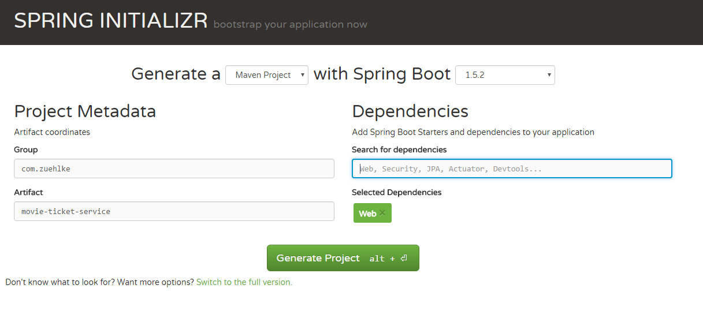
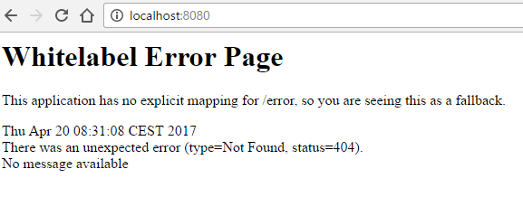
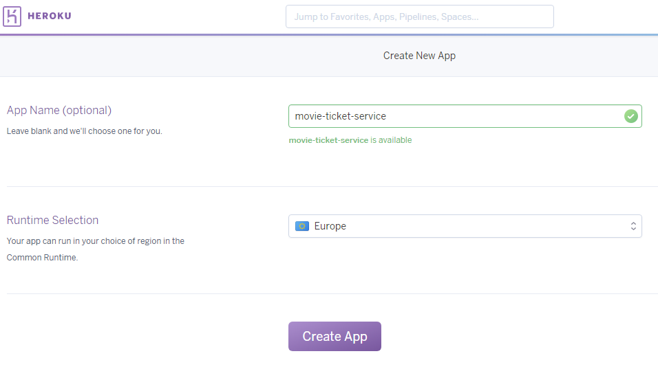

# First Spring Boot App in the Cloud

In this exercise, you learn how to build your first Spring Boot Application and to deploy it to the Cloud.

## Prerequisite

Before you can build and start the workshop you must install and confiugre the following products on your
development machine:

- Java 8
- Maven
- IntelliJ or another Java IDE
- github Account
- Heroku Account

## First Step

In this step you build your first Spring Boot App:

1. Got to http://start.spring.io/

2. Fill out the form as shown on the picture below



> __Note__: It is important to select dependency **Web**

3. Click on "Generate Project"

4. Import the Project in your Java IDE

5. Start the **MovieTicketServiceApplication** from your IDE

You should see the following on your console:

```bash
  .   ____          _            __ _ _
 /\\ / ___'_ __ _ _(_)_ __  __ _ \ \ \ \
( ( )\___ | '_ | '_| | '_ \/ _` | \ \ \ \
 \\/  ___)| |_)| | | | | || (_| |  ) ) ) )
  '  |____| .__|_| |_|_| |_\__, | / / / /
 =========|_|==============|___/=/_/_/_/
 :: Spring Boot ::        (v1.5.2.RELEASE)

```

6. Open http://localhost:8080/ in the browser

Now you should see the "Whitelabel Error Page" shown below:



## Second Step

In this step you add a new REST endpoint and build and start the app from your command line.

1. Add a new Controller (Java class) to Spring Boot

```java
@Controller
public class HelloController {

    @RequestMapping("/hello")
    @ResponseBody
    public String home() {
        return "Hello World!";
    }
}
```

2. Restart the Spring Boot App

3. Open http://localhost:8080/hello in the browser

You should see `Hello World` in your browser :)

4. Stop the App

5. Build the app from the command line

```bash
mvn clean install
```

6. Start the App from the command line

```bash
 java -jar ./target/movie-ticket-service-0.0.1-SNAPSHOT.jar
```

If you open http://localhost:8080/hello in the browser you should still see `Hello World`

7. Stop the App

## Third Step

Now it is time to deploy your application to the cloud.

1. Create a github repository https://github.com/

2. Push your local movie-ticket-service to github

```bash
git init
git add .
git commit -m "first commit"
git remote add origin https://github.com/YOURREPO
git push -u origin master
```

3. Check on github that your project was correctly created


4. Go to https://heroku.com/

5. Create a new App on Heroku e.g. movie-ticket-service or something similar if the name is not available



6. Select deployment method GitHub (Connect to Github)

7. Select your previous created repository on github e.g. movie-ticket-serivice

8. Enable Automatic Deploys

Your configuration should look like the configuration on the picture below:


9. Click on "Deploy Branch" to start Deployment

10. Open the App in your browser e.g. https://movie-ticket-service.herokuapp.com/hello

Check if you see `Hello World` in your browser.

You have finished the first excercise and deployed your first Spring Boot Application to the cloud.