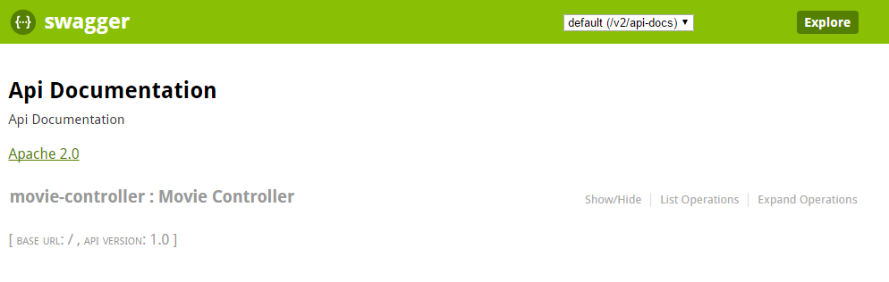

# Get Movies

In this exercise, you build a REST enpoint which returns some information about movies and you add swagger to your project for automatic API documentation.

## First Step

The Movie Ticket Service should return a list with movies for which the user can buy some cinema tickets.
Your task is to implement a REST endpoint **MoiveController** which should support two operations, list all movies and get some details about a specific movie. You can hardcode the return values.

### List all movies

```
GET /api/v1/movies
```

List all available movies.

```json
[
  {
    "id": 1,
    "title": "Batman Begins",
    "poster": "https://images-na.ssl-images-amazon.com/images/M/MV5BNTM3OTc0MzM2OV5BMl5BanBnXkFtZTYwNzUwMTI3._V1_SX300.jpg"
  },
  {
    "id": 2,
    "title": "Ted",
    "poster": "https://images-na.ssl-images-amazon.com/images/M/MV5BMTQ1OTU0ODcxMV5BMl5BanBnXkFtZTcwOTMxNTUwOA@@._V1_SX300.jpg"
  },
  {
    "id": 3,
    "title": "Inception",
    "poster": "https://images-na.ssl-images-amazon.com/images/M/MV5BMjAxMzY3NjcxNF5BMl5BanBnXkFtZTcwNTI5OTM0Mw@@._V1_SX300.jpg"
  }
]
```

### Get a single movie


```
GET /api/v1/movies/{id}
```

Get some more details about a specific movie for example movie ratings

```json
{
  "id": 1,
  "title": "Batman Begins",
  "poster": "https://images-na.ssl-images-amazon.com/images/M/MV5BNTM3OTc0MzM2OV5BMl5BanBnXkFtZTYwNzUwMTI3._V1_SX300.jpg",
  "plot": "After training with his mentor, Batman begins his fight to free crime-ridden Gotham City from the corruption that Scarecrow and the League of Shadows have cast upon it.",
  "year": 2005,
  "genre": "Action",
  "ratings": [
    {
      "source": "Internet Movie Database",
      "value": "8.3/10"
    },
    {
      "source": "Rotten Tomatoes",
      "value": "84%"
    }
  ]
}
```

### Test

Open http://localhost:8080/api/v1/movies and http://localhost:8080/api/v1/movies/{id} in your browser and check if it returns the expected result. Or use `curl` ond the command line.

```bash
curl http://localhost:8080/api/v1/movies
```

## Second Step

It is really helpful to have tool which automaticly doucment your API. This makes it easy for other developers to integrate your service and also helps you to test your own service. In this excerise we use swagger for API documentation. You find more details about swagger
here http://swagger.io/.

### Add Swagger

Add swagger springfox and swagger ui to your pom.xml

```xml
<dependency>
	<groupId>io.springfox</groupId>
	<artifactId>springfox-swagger2</artifactId>
	<version>2.6.1</version>
</dependency>

<dependency>
	<groupId>io.springfox</groupId>
	<artifactId>springfox-swagger-ui</artifactId>
	<version>2.6.1</version>
</dependency>
```

Add the configuration for swagger to your app:

```java
@Configuration
@EnableSwagger2
public class SwaggerConfig {
    @Bean
    public Docket api() {
        return new Docket(DocumentationType.SWAGGER_2)
                .select()
                .apis(RequestHandlerSelectors.any())
                .paths(PathSelectors.ant("/api/**"))
                .build();
    }
}
```

Start your Spring Boot Application. Open http://localhost:8080/swagger-ui.html in your browser. You should see something similar to the screenshot below:

